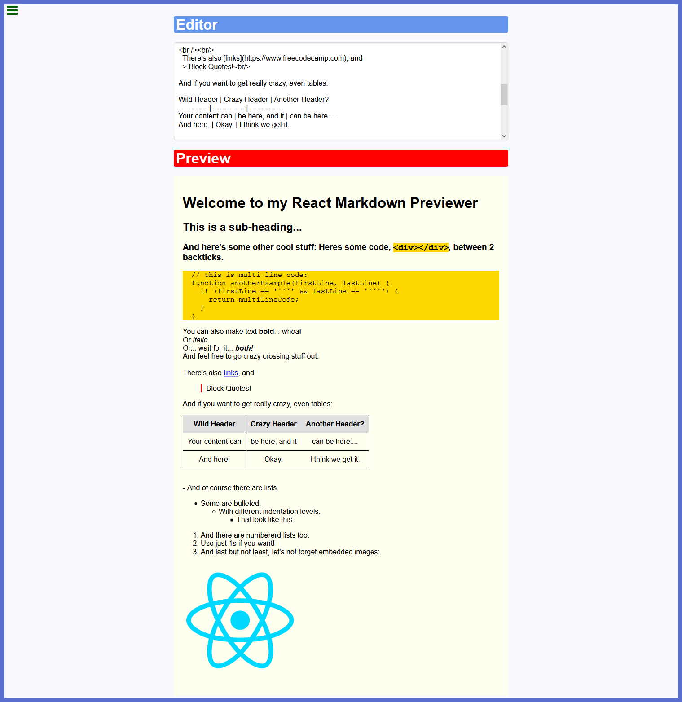

# Markdown Previewer

## Prerequisites

- Editors: vi, vim, emacs, VSCode, Atom
- CodePen or https://cdn.freecodecamp.org/testable-projects-fcc/v1/bundle.js
- HTML5
- CSS
- Javascript
- Applied Visual Design
- Applied Accesability
- Responsive Web Design Principles

## Contributing

--Santiago Yanguas

## Versioning

For my learning of Front End Libraries

## Authors

---Santiago Yanguas

## Files

| Files          | Description                      |
| -------------- | -------------------------------- |
| **css**        | Styles of the Web Page           |
| **index.html** | Principal Web Page               |
| **scripts**    | Source Code of the Functionality |
| **README.md**  | Info of the Project              |
